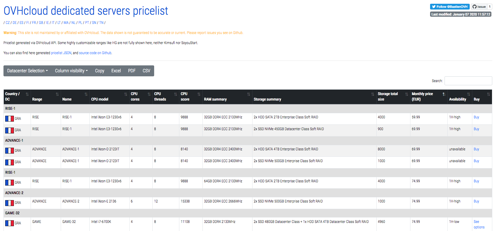

#OVH PRICELIST
Build a webpage showing OVH Cloud products pricelist (dedicated servers only for now).


##Live demo
You can test it via https://pricelist.ovh




##Features
Thanks to datatables.net scripts, 
- Table view of all OVH.com dedicated servers
- Sorting and filtering
- Export to CSV / EXCEL / PDF


##Installation
All you need is a working PHP5.6 or higher and Internet connectivity. No databases.
Then go on index.php though your web browser.
Done

### Tip
On MacOS, you can start a PHP process via command line natively.

``` bash
php -t /Users/myUser/myFolder -S localhost:8000
```

Then go on http://localhost:8000 and you're done.